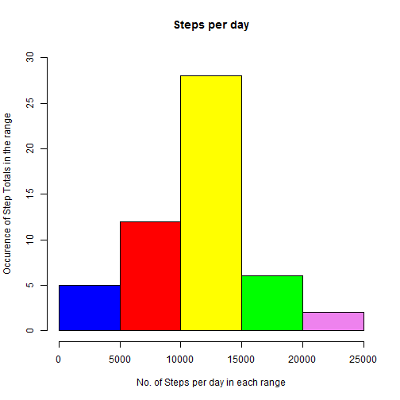

# 'Reproducible Research: Peer assessment 1'
##author: "mf"
##date: "October 9, 2016"

##1. Preparation
```{r}
#knitr::opts_chunk$set(echo = TRUE)
library(knitr)
library(dplyr)
library(Hmisc)
library(ggplot2)
#setwd("...data/RepResearch")
```

### Load Data, convert dates to strings and process only the complete cases (non-NA)

```{r}
actvt <- read.csv("activity.csv", stringsAsFactors = F)
comp_actvt <- actvt[complete.cases(actvt), ]
```
### Mean Total Steps taken per day

``` {r}
mean_step <- comp_actvt %>% group_by(date) %>% 
  summarise(steps_day = sum(steps))

```


##2. Plot no. of steps per day

```{r}

hist(mean_step$steps_day, 
    main = "Steps per day",
    xlab = "No. of Steps per day in each range",
    ylab = "Occurence of Step Totals in the range",
    col = c("blue", "red", "yellow", "green", "violet", "orange", "purple"),
    ylim = c(0, 30))
    
```
<!-- -->
##3. Mean and Median calculation

```{r}
avg_steps   <- mean(mean_step$steps_day, na.rm=TRUE)
median_steps <- median(mean_step$steps_day, na.rm=TRUE)
# Mean = 10766.19
# Median = 10765
```

##4. Time series plot of the average number of steps taken. 
#Group by each interval and then take the mean of the steps in each interval

```{r}
Intvl_range  <- comp_actvt %>% 
            group_by(interval) %>% 
      summarise(avg_steps_intvl = mean(steps))
```

### Plot average distribution

```{r}
plot(Intvl_range$interval, 
     Intvl_range$avg_steps_intvl, 
     type = "l", 
     col = "blue", 
     main = "Average Steps in Intervals",
     xlab = "Daily Intervals",
     ylab = "Step Averages",
     xlim = c(0, 2500),
     ylim = c(0, 250)
    )
    
```

##5. Interval with maximum number of steps

```{r}
max_steps <- Intvl_range[which.max(Intvl_range$avg_steps_intvl), ]
# Interval with maximum steps = 835
# No. of steps in this interval = 206.1698
```

## Code design for Imputing Missing Data

```{r}
withna <- nrow(actvt)
woutna <- nrow(comp_actvt)
diffna <- withna - woutna
diffna
# No.of NA values = 2304
```

### Approach to fill in the missing values.
##6. Create dataset with all vals, then impute the missing values with mean value
```{r}
all_vals_impu <- actvt
all_vals_impu$steps <- impute(all_vals_impu$steps, fun=mean)

```
##7. Plot Histogram of the total number of steps taken each day

```{r}

steps_day_impu <- tapply(all_vals_impu$steps, all_vals_impu$date, sum)

qplot(steps_day_impu, xlab='Steps per day - Imputed', ylab='Occurence per day', binwidth=500)
```
##8. Calculate and report the mean and median total number of steps taken per day.
```{r}
steps_day_impu_mean <- mean(steps_day_impu)
steps_day_impu_median <- median(steps_day_impu)
# Imputed steps per day mean = 10766.19
# Imputed steps per day median = 10766.19
```
# Before filling the missing values:
# Mean = 10766.19
# Median = 10765
# After imputing missing values:
# Imputed steps per day mean = 10766.19
# Imputed steps per day median = 10766.19
# We see that mean has remained unchanged but median has moved by a point and a half. The affect is not sigificant.

##9. Are there differences in activity patterns between weekdays and weekends?


# Convert date variable. Move data variable to weekdays to check for week days and week ends
```{r}
all_vals_impu$dateType <-  ifelse(as.POSIXlt(all_vals_impu$date)$wday %in% c(0,6), 'Weekend Days', 'Week Days')
avg_all_vals_impu <- aggregate(steps ~ interval + dateType, data=all_vals_impu, mean)
```

##10. Make a panel plot containing a time series plot

```{r}
ggplot(avg_all_vals_impu, aes(interval, steps)) + 
    geom_line() + 
    facet_grid(dateType ~ .) +
    xlab("5-minute interval") + 
    ylab("Average No. of steps taken")

```
